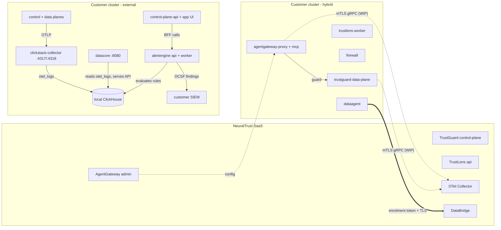

# Platform v2 (`global.platformVersion`)

Platform v2 is the next-generation NeuralTrust stack. It replaces several legacy
components with three new Go services, each split into a control-plane and a
data-plane runtime built from a single image. The whole switch is driven by one
value: `global.platformVersion`.

- `global.platformVersion: v1` (default, or empty/null) — today's stack,
  rendered byte-identical to before. **Nothing changes on upgrade.**
- `global.platformVersion: v2` — the v2 stack. The legacy Python control-plane
  API, data-plane, TrustGate, Kafka, AISPM and SIEM connectors stop deploying;
  AgentGateway, TrustGuard and TrustLens deploy instead.

A second value, `global.deploymentMode`, chooses the split-plane boundary (v2
only):

- `hybrid` (default) — only the **data-plane** workloads deploy on-prem. The
  control-planes stay in NeuralTrust SaaS. **DataAgent** deploys to bridge
  local read-only queries back to the SaaS DataBridge.
- `external` — **control-plane and data-plane** workloads deploy on-prem **plus**
  the self-hosted analytics stack: **clickstack-otel-collector** ingests OTLP
  into ClickHouse, **DataCore** serves the residency query API, and
  **AlertEngine** evaluates detection rules over that ClickHouse telemetry and
  forwards findings to SIEMs. The product **control-plane API + App UI**
  (`neuraltrust-control-plane` `api` + `app`) **auto-enable on-prem** from the
  platform flags — no `controlPlane.enabled` needed — so the console is available
  without SaaS; the legacy `scheduler` stays off. A zero-SaaS-dependency install;
  **DataAgent is not deployed**. Set `global.observability.hostedExport.enabled=false`
  to keep telemetry fully in-cluster.
- `full` — **DEPRECATED** alias for `external`; renders byte-identically.

### In-cluster datastores (v2 defaults)

- **Postgres** deploys in-cluster by default in **all** v2 modes (the existing
  `control-plane-postgresql`). The `isV2`-guarded `v2-postgresql-init` Job provisions
  it **per deployment mode**:
  - **hybrid** (data planes only; DataAgent reads Postgres) — AgentGateway and
    TrustGuard share **one** database (`trustdata`) but each writes into its **own
    schema** (named after its role), with the role's `search_path` defaulted there.
    That keeps their identically-named migration trackers (both TrustGate and
    TrustGuard ship `migration_versions`) from colliding. The Job also provisions a
    **read-only `dataagent` role** granted `SELECT` on both schemas whose `search_path`
    spans them, so DataAgent's **unqualified** `SELECT ... FROM "<table>"` resolves.
    Raw telemetry is written via the postgres exporter (`SENSIBLE_PG_DSN`, see below).
  - **external** (control + data on-prem; DataCore reads ClickHouse) — each service
    gets its **own** database (`agentgateway`, `trustguard`) on `public`, because the
    control planes run on-prem and own their migrations. There is no shared Postgres
    reader (DataAgent is not deployed).
  - `trustlens` and `alertengine` keep their own separate databases (own migrations).
    Each service's `database.host` **auto-derives** to `control-plane-postgresql`
    (empty = in-cluster); `database.name` is **mode-derived** when left empty
    (external: the service name; hybrid: `trustdata`); passwords auto-generate. For
    **external** Postgres, overlay `database.host` + `database.password` and set
    `neuraltrust-control-plane.infrastructure.postgresql.deploy=false` (or
    `global.postgresql.deploy=false`); the operator pre-creates the per-service DBs,
    roles and grants.
- **Redis** deploys in-cluster by default in all v2 modes (umbrella-managed
  service `redis`, `infrastructure.redis.deploy=true`). Services default their
  `redis.host` to `redis`. Set `infrastructure.redis.deploy=false` and override
  the hosts for hosted Redis/Memorystore.
- **ClickHouse** deploys in-cluster by default in **all** v2 modes
  (`infrastructure.clickhouse.deploy=true`). It backs the temporary
  `data-plane-api` analytics shim (see below) in every mode and the
  `clickstack-otel-collector` + `datacore` stack in `external`. Set
  `infrastructure.clickhouse.deploy=false` and point the endpoints at a hosted
  instance to use external ClickHouse.
- **Kafka** is not part of v2 — it never renders under `platformVersion=v2`.
- **`data-plane-api` shim (temporary, until TrustLens)** — under v2 the legacy
  `neuraltrust-data-plane` subchart is disabled **except** its `api` component,
  which is kept in **all** v2 modes as the read/analytics API over ClickHouse.
  Only the API renders (Deployment, Service/Ingress, ServiceAccount, its
  `clickhouse-secrets` + `clickhouse-init-job` ConfigMap); the **kafka-workers**
  (`data-plane-worker`) and **kafka-connect** stay disabled. The API boots
  without a broker (Kafka init is best-effort and non-fatal; only ingest/eval
  endpoints use Kafka and degrade gracefully). Note: with no Kafka/worker
  consumer, ingest endpoints do not populate ClickHouse yet — the shim serves
  reads; the write path lands with TrustLens. Controlled by the existing
  `neuraltrust-data-plane.dataPlane.components.api.enabled` (default on).
- Non-TLS in-cluster Postgres: v2 services default `database.sslMode: prefer`,
  which uses TLS when available and falls back to plaintext. `prefer` also
  satisfies TrustGuard's production guard (which rejects only `disable`).
- **TrustLens** is **disabled by default** (`trustlens.enabled=false`, WIP).

## Components

| v2 subchart | Control-plane (external only) | Data-plane (hybrid + external) | Image | Datastores |
|---|---|---|---|---|
| `agentgateway` (TrustGate v2) | `agentgateway-admin` (`admin`, :8080) | `agentgateway-proxy` (`proxy`, :8081) + `agentgateway-mcp` (`mcp`, :8082) | `agentgateway` | Postgres, Redis |
| `trustguard` | `trustguard-control-plane` (admin API) | `trustguard-data-plane` (`/v1/evaluate` runtime) | `trustguard` | Postgres, Redis |
| `trustlens` (WIP, off by default) | `trustlens-api` (`/api`) | `trustlens-worker` (`/worker`, River jobs) | `trustlens` | Postgres |

The v2 data pipeline subcharts render only in specific modes:

| v2 subchart | Mode | Workload | Image | Datastores |
|---|---|---|---|---|
| `dataagent` | `hybrid` only | `dataagent` (outbound-only gRPC to SaaS DataBridge, :8080 health) | `dataagent` | shared `trustdata` Postgres (read-only) |
| `clickstack-otel-collector` | `external` only | `clickstack-collector` (OTLP :4317/:4318 → ClickHouse) | `docker.clickhouse.com/clickhouse/clickstack-otel-collector` | ClickHouse |
| `datacore` | `external` only | `datacore` (residency query API, :8080) | `datacore` | ClickHouse |
| `alertengine` | `external` only | `alertengine-api` (:8085, BFF-internal) + `alertengine-worker` (evaluation + SIEM forwarding, health :8086) | `alertengine` | own `alertengine` Postgres DB + ClickHouse (read) |

In `external` mode the product control-plane **auto-renders** from the platform
flags — `control-plane-api` (Python management API) + `control-plane-app`
(Next.js console / BFF) — no `controlPlane.enabled` needed (it is ignored in v2;
in v2 hybrid the console stays SaaS-side even if set). The `scheduler` stays
disabled in all v2 modes. This is driven by the subchart helper
`neuraltrust-control-plane.controlPlaneEnabled`.

DataCore, AlertEngine, `clickstack-otel-collector` and the `data-plane-api` shim
authenticate to ClickHouse with a **single shared credential**: all read
`CLICKHOUSE_PASSWORD` from the in-cluster `clickhouse` secret (key `admin-password`)
via their `clickhouse.existingSecret` default (for the shim,
`dataPlane.components.clickhouse.existingSecret`), rather than generating their own.
For external ClickHouse (`infrastructure.clickhouse.deploy=false`), point
`existingSecret` at the secret holding your password (matches
`infrastructure.clickhouse.external.secretName/Key`) and set the ClickHouse host to
your endpoint — a dotted/FQDN host is used verbatim, while a bare service name
expands to `<name>.<namespace>.svc.cluster.local`.

**Deployment portability.** The v2 stack is designed for customer clusters: point
every image at a mirror with `global.imageRegistry` (helpers strip the default
vendor prefix, including the third-party `clickstack-otel-collector` image); set
ingress hostnames from `global.domain`; opt out of image pull secrets on clusters
with node/cluster-wide registry creds via `imagePullSecrets: "none"` (works at the
subchart root and for the nested `controlPlane.imagePullSecrets` /
`dataPlane.imagePullSecrets`); deploy into any namespace (no hardcoded namespaces);
and use any external Postgres/Redis/ClickHouse by setting
`infrastructure.{postgresql,redis,clickhouse}.deploy=false` plus the per-service
`database.host` / `redis.host` / `clickhouse.*` overrides. Postgres `sslMode`
defaults to `prefer` (works against non-TLS in-cluster PG and TLS hosted DBs); set
`sslMode: require` per service to force TLS. External Kafka uses
`global.kafka.bootstrapServers` (+ SASL/TLS).

**Optional IAM auth (AWS).** The Python control-plane supports RDS IAM auth today
(`neuraltrust-control-plane.controlPlane.components.postgresql.authMode: iam`).
For the v2 Go services (AgentGateway, TrustGuard, AlertEngine) the chart is
*prepared* for IAM — `database.iamAuth` / `redis.iamAuth` (default `false`) emit
`DB_IAM_AUTH`/`DB_AUTH_MODE`/`REDIS_IAM_AUTH` and omit the static password — but
the service-side token minting is not implemented yet. See `my-values-aws-v2-iam.yaml`
for a full IAM overlay and `my-values-aws-v2.yaml` for the password variant.

`neuraltrust-firewall`, `clickhouse` and the in-chart OTel Collector are
unaffected by the switch and keep their own flags.

> **External-mode prerequisite:** DataCore runs embedded ClickHouse migrations
> that materialize its tables from the `otel_logs` landing table written by
> `clickstack-otel-collector`. Deploy/point the collector at ClickHouse so
> `otel_logs` exists before (or shortly after) DataCore first starts.
> ClickHouse defaults to the in-cluster subchart; set the `datacore.clickhouse.*`
> and `clickstack-otel-collector.clickhouse.*` endpoints to an external instance
> when `infrastructure.clickhouse.deploy=false`.

> Telemetry in v2 flows from the data services to the SaaS OTel Collector over
> mTLS gRPC. That wiring is a work-in-progress and is intentionally out of scope
> for the current scaffold.

## v1 → v2 component mapping

| Legacy (v1) | Fate under v2 | Replacement |
|---|---|---|
| `trustgate` | disabled | `agentgateway` (admin/proxy/mcp) |
| `neuraltrust-control-plane` (Python `api` + `scheduler`) | `scheduler` disabled in all v2; `api` + `app` auto-enable in **external** (flag-driven, `controlPlane.enabled` ignored; SaaS-side in hybrid) | control-planes of AgentGateway / TrustGuard / TrustLens; product console (`app`) on-prem in external |
| `neuraltrust-data-plane` (FastAPI + Kafka workers) | **`api` kept** as a temporary shim (all v2 modes); workers/kafka-connect disabled | `trustlens` + the v2 data pipeline (`dataagent` / `datacore` / `clickstack-otel-collector`) |
| `kafka` | disabled | mTLS gRPC → SaaS OTel Collector (WIP); ClickHouse via `clickstack-otel-collector` in external mode |
| `neuraltrust-aispm` | disabled | — |
| `neuraltrust-siem-connectors` | disabled | `alertengine` SIEM forwarder (external mode) |
| `neuraltrust-firewall` | **kept** | — |
| `clickhouse` | **kept** | — |
| OTel Collector | **kept** | — |

## Topology



In `external` mode the control-plane boxes move into the customer cluster
alongside the data-plane workloads plus the self-hosted analytics stack shown
above, dropping the SaaS dependency entirely (no DataAgent). `full` is a
deprecated alias that renders identically to `external`.

## How the switch works

Helm `condition:` in `Chart.yaml` can only read a static boolean, so it cannot
compute enablement from `global.platformVersion`. Instead the switch is
implemented with template guards backed by two helpers in
`templates/_helpers.tpl`:

- `neuraltrust-platform.isV2` — non-empty when `global.platformVersion == v2`.
- `neuraltrust-platform.isExternal` — non-empty when `global.deploymentMode` is
  `external` (or the deprecated `full` alias). Gates the v2 control-planes,
  `clickstack-otel-collector` + `datacore` + `alertengine`, and the re-enabled
  legacy `neuraltrust-control-plane` `api`/`app`.
- `neuraltrust-control-plane.controlPlaneEnabled` (subchart helper) — whether the
  product console stack renders: in **v2** it returns true only in `external`
  (ignoring `controlPlane.enabled`, so v2 hybrid stays SaaS-side); in **v1** it
  returns `controlPlane.enabled`. Used across the `api`/`app`/`secrets`/
  `serviceaccount`/`hpa`/`monitoring`/`poddisruptionbudgets`/`scheduler` templates
  (scheduler is additionally `not isV2`-gated).
- `neuraltrust-platform.isFull` — **DEPRECATED** alias of `isExternal` (kept so
  existing control-plane guards keep working). `full` == `external`.
- `neuraltrust-platform.isHybrid` — non-empty when `global.deploymentMode == hybrid`.
  Gates `dataagent`.
- `neuraltrust-platform.clickhouseAllowed` — now always non-empty (v1 and every
  v2 mode need ClickHouse); still gates every `charts/clickhouse` template so the
  intent stays explicit, with actual rendering governed by
  `infrastructure.clickhouse.deploy`.
- `neuraltrust-platform.dataPlaneApiV2.enabled` — non-empty when `isV2` AND the
  data-plane `dataPlane.enabled` AND `dataPlane.components.api.enabled`. Gates the
  temporary `data-plane-api` shim templates (`api/*`, `serviceaccount.yaml`,
  `clickhouse-config/secrets.yaml`, `clickhouse-config/sql-configmap.yaml`), which
  render under v1 OR this helper. Must be invoked from the data-plane subchart
  context. kafka-workers and kafka-connect are **not** gated by it and stay off.

Every template in the v2 subcharts is wrapped in
`{{- if eq (include "neuraltrust-platform.isV2" .) "true" }}`; control-plane
templates additionally require `isFull`, `dataagent` additionally requires
`isHybrid`, and `datacore` / `clickstack-otel-collector` additionally require
`isExternal`. The disabled legacy subcharts wrap their template bodies in
`{{- if not (eq (include "neuraltrust-platform.isV2" .) "true") }}`.
Because the helpers read `.Values.global` (which Helm shares with every
subchart), a single `--set global.platformVersion=v2` flips the entire stack.

## Usage

Hybrid (most customers):

```bash
helm upgrade --install neuraltrust-platform . -f values-v2.yaml.example
```

External (zero-SaaS-dependency, self-hosted analytics):

```bash
helm upgrade --install neuraltrust-platform . \
  -f values-v2.yaml.example --set global.deploymentMode=external \
  --set global.observability.hostedExport.enabled=false
```

See [`values-v2.yaml.example`](../values-v2.yaml.example) for the operator knobs
(image tags, external Postgres/Redis hosts, DataAgent enrolment/tenant,
DataCore/collector ClickHouse endpoints). Full subchart defaults live in
`charts/{agentgateway,trustguard,trustlens,dataagent,datacore,clickstack-otel-collector}/values.yaml`.

### Auto-wired URLs and client credentials

In a single-umbrella deploy these need **no** values:

- **AgentGateway → TrustGuard URL** (`TRUSTGUARD_BASE_URL`) auto-derives to the
  in-cluster data-plane Service `http://trustguard-data-plane.<namespace>.svc.cluster.local`
  (port 80). Override `agentgateway.trustguard.baseURL` only when TrustGuard runs
  outside the release.
- **TrustGuard token audience** (`TRUSTGUARD_BASE_URL`, the `aud` stamped on and
  validated for platform tokens) auto-derives to `https://trustguard.<global.domain>`
  (falling back to the in-cluster URL so it is never empty). Override
  `trustguard.platform.baseURL` for a bespoke public audience.
- **Client credentials** — the AgentGateway proxy authenticates to TrustGuard with
  a `client_credentials` pair (`scope=platform`); TrustGuard validates it against
  its `TRUSTGUARD_PLATFORM_CLIENT_ID`/`_SECRET`. Both sides read the **same** id +
  secret from one parent Secret `v2-trustguard-client-secret` (client id
  `global.v2.trustguardClientId`, default `agentgateway-platform`; secret
  auto-generated or `global.v2.trustguardClientSecret`), so the pair always
  matches. `clientId` = the OAuth2 client identity used for that token exchange.

## Secrets & variables (required vs optional)

With `global.autoGenerateSecrets: true` (default), passwords and signing keys are
generated on first install and preserved across upgrades via `lookup`. Env var
names below are what each **binary actually reads** (verified against source).

**AgentGateway** (`agentgateway-secrets`, `agentgateway-env-vars`)
- Auto-generated: `SERVER_SECRET_KEY`, `DB_PASSWORD`, plus the shared
  `TRUSTGUARD_CLIENT_ID`/`_SECRET` (from `v2-trustguard-client-secret`). **Hybrid
  only:** `SENSIBLE_PG_DSN` (raw-telemetry DSN into `trustdata`, own `agentgateway`
  schema) — consumed by the postgres raw exporter mounted via the
  `agentgateway-telemetry` ConfigMap (`TELEMETRY_EXPORTERS_FILE`).
- Defaulted for in-cluster: `DB_HOST` (auto → `control-plane-postgresql`),
  `DB_NAME` (mode-derived: external `agentgateway` / hybrid `trustdata`),
  `DB_USER=agentgateway`, `REDIS_HOST=redis`, `GATEWAY_BASE_DOMAIN`/`MCP_BASE_DOMAIN`
  (from `global.domain`), `TRUSTGUARD_BASE_URL` (auto in-cluster),
  `TELEMETRY_ENABLED=false` (no Kafka).
- Note: the app reads `DB_*` and `GATEWAY_BASE_DOMAIN`/`MCP_BASE_DOMAIN` — **not**
  `DATABASE_*` / `SERVER_BASE_DOMAIN`.

**TrustGuard** (`trustguard-secrets`, `trustguard-env-vars`)
- Auto-generated: `ADMIN_JWT_SECRET`, `TRUSTGUARD_TOKEN_SIGNING_SECRET`,
  `DB_PASSWORD`, plus the shared `TRUSTGUARD_PLATFORM_CLIENT_ID`/`_SECRET`. **Hybrid
  only:** `SENSIBLE_PG_DSN` (raw-telemetry DSN into `trustdata`, own `trustguard`
  schema) — consumed by the postgres raw exporter mounted via the
  `trustguard-telemetry` ConfigMap (`TELEMETRY_EXPORTERS_FILE`).
- Defaulted for in-cluster: `DB_HOST` (auto), `DB_NAME` (mode-derived: external
  `trustguard` / hybrid `trustdata`), `DB_USER=trustguard`, `REDIS_HOST`,
  `DB_SSL_MODE=prefer` (passes the production guard against non-TLS Postgres),
  `TRUSTGUARD_BASE_URL` (auto from `global.domain`).
- Optional: `platform.baseURL` override, `redis.password`.

**DataAgent** (`dataagent-secrets`, `dataagent-env-vars`) — hybrid only
- Auto-generated: `DB_PASSWORD` (read-only `dataagent` role in `trustdata`,
  provisioned by `v2-postgresql-init`; its `search_path` spans the `agentgateway` and
  `trustguard` writer schemas so unqualified reads resolve); `DATABASE_URL` is
  assembled from the `database` components (host auto-derives; overlay for external)
  unless `databaseUrl` is set explicitly.
- **Never auto-generated**: `ENROLMENT_TOKEN` (SaaS-issued) — sourced from values,
  preserved from the existing secret on upgrade.
- Required: `tenantId`, `enrolmentToken`. `databridge.addr`/`serverName` default to
  the SaaS DataBridge (`databridge.neuraltrust.ai`). Raw source rows are written by
  the AgentGateway/TrustGuard postgres raw exporter (`SENSIBLE_PG_DSN`) into their
  per-service schemas in `trustdata`.

## Keeping v2 in sync

Any change to a v2 component must update the component-registry touchpoints in
the same PR — see [`.cursor/rules/component-registry.mdc`](../.cursor/rules/component-registry.mdc)
and [`.cursor/rules/platform-v2.mdc`](../.cursor/rules/platform-v2.mdc).
