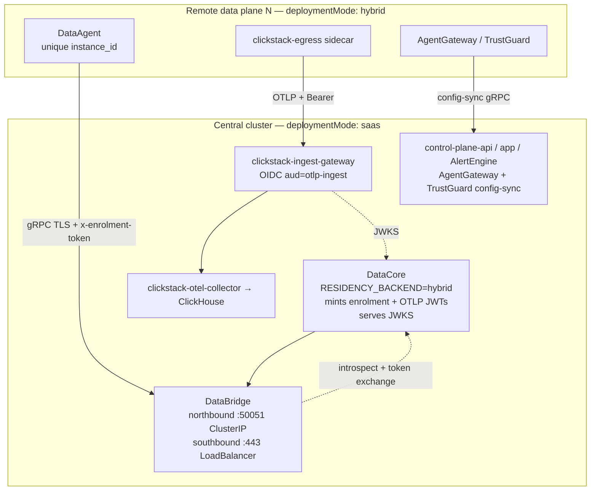

# `saas` mode — run your own control plane for data planes in other clusters

`global.deploymentMode: saas` renders a control plane that behaves like
NeuralTrust's hosted one, but is yours. Data planes in other clusters — typically
one per business unit, jurisdiction or environment — enrol into it instead of
into `neuraltrust.ai`.

Use it when a single `external` install cannot work because the data must stay
where it was produced, but the console, alerting and cross-cluster reporting
have to be in one place.

| If you want… | Use |
|---|---|
| Everything in one cluster | [`external`](../README-EXTERNAL.md) |
| NeuralTrust-hosted control plane | [`hybrid`](../README.md#quick-start-hybrid) |
| Your control plane + remote data planes | **this doc** |

---

## Quick start

Assumes you already know how to install **external** (datastores, ingress, image
pull secret). SaaS is the same chart with one mode flip, then three out-of-band
steps the chart cannot do for you.

### Central cluster (control plane)

1. **Values** — mode + domain. Everything else is chart default:

   ```yaml
   global:
     deploymentMode: saas
     domain: platform.example.com   # UI hosts + hybrid dial names
     platform: aws                  # if EKS (ALB + default internal NLBs)
   ```

2. **Install / upgrade** like external (same release name and namespace):

   ```bash
   helm upgrade --install neuraltrust-platform . -n neuraltrust --create-namespace \
     -f values-required.yaml \
     -f your-external-or-saas-values.yaml
   ```

3. **Wait for L4 load balancers**, then create DNS (or skip DNS and use raw NLB
   hostnames on hybrids — step 7):

   ```bash
   kubectl -n neuraltrust get svc \
     databridge-southbound \
     agentgateway-admin-configsync \
     trustguard-control-plane-configsync
   # Point A/AAAA (or CNAME) records:
   #   databridge.<domain>              → databridge-southbound
   #   agentgateway-configsync.<domain> → agentgateway-admin-configsync
   #   trustguard-configsync.<domain>   → trustguard-control-plane-configsync
   #   telemetry.<domain>               → ALB / Ingress (same as app/api)
   ```

4. **Export the chart CA** (default self-signed path). This does **not** create a
   Secret on the control plane — it builds a bundle for remote clusters:

   ```bash
   # kubectl context = central cluster
   ./scripts/export-controlplane-ca.sh -n neuraltrust -o controlplane-ca.yaml
   # Expect something like:
   #   bundled 3 CA certificate(s) from: databridge-southbound-tls …
   ```

   Skip this step only if every southbound leaf is from a CA the data planes
   already trust (public CA or your PKI) — see [TLS](#tls).

5. **Open the console** (`https://app.<domain>`) and create a **Private gateway**
   per remote plane. Copy the **enrolment** and **config-sync** tokens (issued by
   *your* DataCore, not NeuralTrust SaaS).

### Each remote data plane (hybrid)

6. **Apply the CA bundle** in the hybrid namespace:

   ```bash
   # kubectl context = remote cluster
   kubectl create namespace neuraltrust --dry-run=client -o yaml | kubectl apply -f -
   kubectl apply -f controlplane-ca.yaml -n neuraltrust
   ```

7. **Install hybrid** pointed at your control plane:

   ```yaml
   global:
     deploymentMode: hybrid
     platform: aws          # if EKS
     products:
       trustgate: true
     controlPlane:
       domain: platform.example.com
       caSecretName: controlplane-ca
       # Only when DNS for *.<domain> is not ready yet (SNI still uses domain):
       # databridgeAddr: "<nlb-hostname>:443"
       # configSyncAddr: "<nlb-hostname>:443"
   agentgateway:
     configSync:
       token: "<from console>"
     dataagent:
       enrolment:
         token: "<from console>"
   ```

   ```bash
   helm upgrade --install neuraltrust-platform . -n neuraltrust --create-namespace \
     -f values-required.yaml \
     -f your-hybrid-values.yaml
   ```

8. **Verify** from inside the remote cluster that TCP 443 reaches all four
   endpoints (blocked security groups look like a healthy plane serving stale
   config). Check DataAgent and config-sync pods are Ready and not crash-looping
   on TLS handshake errors.

### Defaults you get without further knobs

| Default | What |
|---|---|
| Dial names from `global.domain` | `databridge.`, `*-configsync.`, `telemetry.` |
| DataBridge HA | `replicas: 2` + peer headless Service |
| Self-signed TLS | DataBridge + published config-sync (export CA → step 4) |
| AWS L4 NLBs | `internal` when `platform=aws` and annotations empty |
| Telemetry Ingress | ON, inherits `global.ingress` (ACM/ALB) |

### Common escape hatches

| Need | Knob |
|---|---|
| Cheap / singleton DataBridge | `databridge.replicas: 1` |
| Dial names ≠ UI domain | `global.controlPlane.domain` |
| Hybrids over the public internet | `global.controlPlane.loadBalancerScheme: internet-facing` |
| Corporate / ACM / PKI leaves | [TLS](#tls) BYO `existingSecret` |
| Keep config-sync off the public LB | `*.configSync.expose.enabled: false` |

Full detail below. Network allowlists for **NeuralTrust-hosted** hybrid are in
[`hybrid-network.md`](./hybrid-network.md); for **customer saas**, allowlist
*your* four endpoints instead.

---

## Topology



`saas` is a superset of `external`: everything `external` renders, plus three
additions and one behaviour change.

| Addition | Why |
|---|---|
| `databridge` | Remote DataAgents hold a bidirectional gRPC stream here; DataCore queries across them northbound. Stores nothing. |
| `clickstack-ingest-gateway` | Public OTLP edge. Verifies DataCore-issued RS256 JWTs and stamps the tenant from the verified claim, so an untrusted sender cannot write another tenant's telemetry. |
| Published config-sync Services | Products in the remote clusters pull their configuration from the central control planes. |

The behaviour change: DataCore runs `RESIDENCY_BACKEND=hybrid` rather than
`saas`, so entitled reads go out through DataBridge to the remote clusters
instead of straight to the local ClickHouse.

## Endpoints

On **saas**, the bare domain is `global.domain` (or `global.controlPlane.domain`
when set). On **hybrid** remotes, set `global.controlPlane.domain` to that same
suffix (or leave NeuralTrust SaaS via `global.saasRegion` when empty).

| Endpoint | Served by | Dialled by |
|---|---|---|
| `databridge.<domain>:443` | `databridge-southbound` Service | DataAgent |
| `https://telemetry.<domain>` | `clickstack-ingest-gateway` Ingress | clickstack-egress sidecar |
| `agentgateway-configsync.<domain>:443` | `agentgateway-admin-configsync` Service | AgentGateway data plane |
| `trustguard-configsync.<domain>:443` | `trustguard-control-plane-configsync` Service | TrustGuard data plane |

One knob drives all four on purpose. A remote cluster that reached DataBridge
on your domain but still dialled NeuralTrust for config-sync would half-work,
and the half that broke would be silent.

## Prerequisites

Before installing, have these ready. Everything else the chart does for you.

| | What | Notes |
|---|---|---|
| 1 | Four DNS records, from the table above, resolving to the central cluster's load balancers | Create them after the first install, once the LBs have addresses. A private zone is fine. |
| 2 | A decision on certificates | See [TLS](#tls). Chart-generated needs nothing from you up front. |
| 3 | Network reachability from every remote cluster to all four endpoints | Peering, Transit Gateway, Direct Connect or the public internet — the chart does not care which. |
| 4 | An ingress controller in the central cluster | Only the telemetry endpoint uses one; the other three are layer-4 Services. |
| 5 | One enrolment token per remote data plane, from your console | See [Authentication](#authentication). |

### Images

Two images on top of the external set, both from the NeuralTrust registry, both
covered by the `gcr-secret` pull secret an external install already has:

```
europe-west1-docker.pkg.dev/neuraltrust-app-prod/nt-docker/databridge
europe-west1-docker.pkg.dev/neuraltrust-app-prod/nt-docker/opentelemetry-collector-contrib
```

The second is the same image and tag the hybrid egress sidecars run, so a mirror
that already carries it needs nothing new. `scripts/release-images-markdown.sh`
prints the full list with resolved tags for a mirroring run.

`global.imageRegistry` retargets both, including the collector — it strips the
NeuralTrust registry rather than prefixing it, so the result is
`<your-registry>/databridge`, not `<your-registry>/europe-west1-docker.pkg.dev/…`.
The two older collector copies (`global.observability.collector`,
`global.clickstack.egress`) are the exception and still need their `repository`
set by hand.

## TLS

All four endpoints are dialled from other clusters. Each needs a certificate
covering its hostname, and each remote cluster needs to accept it.

### Default: chart-generated (private network)

With no `existingSecret`, saas mints self-signed leaves for DataBridge and both
config-sync listeners. Telemetry Ingress follows `global.ingress` (often ACM on
the ALB); set `clickstack-ingest-gateway.ingress.tls.autoGenerate: true` only when
you also need a chart CA on that host.

Export the CAs from the central cluster and apply them on every remote plane:

```bash
./scripts/export-controlplane-ca.sh -n neuraltrust -o controlplane-ca.yaml
```

Until you do, every remote handshake fails: minting a certificate does not make
anyone trust it. Keypairs are preserved across upgrades and reissued only when
the names they cover change.

### Customize: bring your own

| Endpoint | Bring your own | cert-manager |
|---|---|---|
| `databridge.<domain>:443` | `databridge.tls.existingSecret` | `databridge.tls.certManager.enabled: true` |
| `*-configsync.<domain>:443` | `*.configSync.grpcTls.existingSecret` | — |
| `https://telemetry.<domain>` | `ingress.tls.secretName` or ACM via `global.ingress` | via annotations |

```yaml
databridge:
  tls:
    autoGenerate: false
    existingSecret: databridge-southbound-tls
agentgateway:
  configSync:
    grpcTls:
      existingSecret: agentgateway-configsync-tls
trustguard:
  configSync:
    grpcTls:
      existingSecret: trustguard-configsync-tls
```

On EKS, ACM cannot serve DataBridge or config-sync (TLS terminates in the pod).
ACM can serve telemetry via the ALB.

### Keeping an endpoint off a load balancer entirely

To reach a config-sync listener over peering without publishing a Service, set
`<product>.configSync.expose.enabled: false` and route to the ClusterIP yourself.

For the endpoints that do get a LoadBalancer, prefer an internal scheme when the
callers are on a private network — see [AWS / EKS](#aws--eks).

## Authentication

DataBridge must be able to tell the remote data planes apart. Two modes do that:

| `databridge.auth.mode` | How |
|---|---|
| `introspect` (default) | DataBridge asks the in-cluster DataCore about each enrolment token |
| `jwt` | DataBridge verifies DataCore-signed enrolment JWTs locally |

`token` and `dev` are rejected in `saas`. Both authenticate every data plane
with one shared credential and then trust the tenant each agent claims for
itself, so any enrolled data plane could read another's data.

Mint one enrolment token per remote data plane, each with its own
`instance_id`. Reusing one token collapses them into a single identity in every
query and audit trail.

## Secrets

Credentials in the shared `platform-secrets` (generated when the chart owns
secrets):

| Key | Used by |
|---|---|
| `ENROLMENT_INTROSPECTION_TOKEN` | DataCore — compares what DataBridge presents |
| `DATACORE_SERVICE_TOKEN` | DataBridge — alias of the above, must hold the identical value |
| `ENROLMENT_SIGNING_SECRET` | DataCore — signs enrolment tokens |
| `CONFIG_SYNC_SIGNING_SECRET` | DataCore mints private-gateway install JWTs; admin verifies as `CONFIG_SYNC_JWT_SECRET` |
| `TELEMETRY_JWT_PRIVATE_KEY_PEM` | DataCore — RS256 key for `aud=otlp-ingest` tokens the ingest gateway verifies |

If you pre-provision secrets yourself (`global.preserveExistingSecrets`,
`global.autoGenerateSecrets: false`, or `global.platformSecret.existingSecret`),
all of the above must be present, and the two token keys must hold one identical
value — otherwise every agent connection returns 401 with nothing visibly wrong
on either side. `./create-secrets.sh` with `DEPLOYMENT_MODE=saas` writes them
correctly, including the alias. Full table: [SECRETS.md](../SECRETS.md).

## AWS / EKS

With `global.platform: aws`, empty L4 annotations get NLB defaults from one knob:

```yaml
global:
  platform: aws
  controlPlane:
    loadBalancerScheme: internal   # default; or internet-facing
```

That covers DataBridge southbound and both config-sync expose Services. Local
`annotations` on a service always win when set. Restrict source ranges when you
know remote egress CIDRs:

```yaml
databridge:
  service:
    southbound:
      loadBalancerSourceRanges: ["10.20.0.0/16"]
```

On GKE use `networking.gke.io/load-balancer-type: "Internal"`; on AKS,
`service.beta.kubernetes.io/azure-load-balancer-internal: "true"` (set as local
annotations — chart defaults are AWS-only).

Notes:

- **NLB, not ALB** for DataBridge and config-sync (long-lived gRPC, TLS in-pod).
- **Telemetry is HTTP** → Ingress / ALB via `global.ingress`.
- **DataBridge HA** is default (`replicas: 2` + peer forwarding). Opt down with
  `databridge.replicas: 1` for cheap dev clusters.
- **Central data stores** follow `external` guidance — see [Datastores](../README.md#datastores).

## Remote clusters

Each remote cluster is an ordinary `hybrid` install pointed at your domain:

```yaml
global:
  deploymentMode: hybrid
  controlPlane:
    domain: nt.example.com
  products:
    trustgate: true
    trustguard: true
```

Its enrolment and config-sync tokens are issued by **your** console, not by the
NeuralTrust one. Everything else in the
[hybrid quick start](../README.md#quick-start-hybrid) applies unchanged.

### One-knob retarget (domain + optional dial hosts + CA)

`global.controlPlane` is the single place to point a hybrid install at a
distinct control plane — the same model as the Docker bundle's
`CONTROL_PLANE_*` env vars:

| Values key | Expands to |
|---|---|
| `domain` | `databridge.<domain>:443`, `<product>-configsync.<domain>:443`, `https://telemetry.<domain>` |
| `databridgeAddr` | DataAgent `DATABRIDGE_ADDR` (SNI stays `databridge.<domain>`) |
| `configSyncAddr` | both products' `CONFIG_SYNC_GRPC_ENDPOINT` (SNI stays `<product>-configsync.<domain>`) |
| `telemetryUrl` | egress collector OTLP/HTTP base |
| `caSecretName` | mount + `TLS_CA_FILE` / `CONFIG_SYNC_TLS_CA` / egress `ca_file` |

```yaml
global:
  deploymentMode: hybrid
  controlPlane:
    domain: neuraltrust.es
    # Optional: dial raw NLBs when DNS for *.<domain> is not ready yet.
    # SNI still uses the domain-derived cert names above.
    databridgeAddr: k8s-neuraltr-databrid-….elb.eu-west-1.amazonaws.com:443
    configSyncAddr: k8s-neuraltr-agentgat-….elb.eu-west-1.amazonaws.com:443
    # telemetryUrl: https://k8s-….elb.amazonaws.com   # only if telemetry is also on an NLB
    caSecretName: controlplane-ca   # apply scripts/export-controlplane-ca.sh output first
  products:
    trustgate: true
```

Per-product overrides (`dataagent.databridge.addr`, `agentgateway.configSync.endpoint`,
`global.clickstack.egress.endpoint`, explicit `tlsCa` paths) still win when set.

### Trusting a chart-generated control plane

Only needed if the central cluster serves chart-generated certificates. Apply the
bundle from `scripts/export-controlplane-ca.sh`, then either use the one-knob
form above (`caSecretName`) or expand the three legs by hand:

```yaml
global:
  controlPlane:
    domain: nt.example.com
    caSecretName: controlplane-ca   # preferred — expands all three legs
# equivalent long form:
#   customCaCert:
#     enabled: true
#     secretName: controlplane-ca
#   clickstack:
#     egress:
#       tlsCaSecretName: controlplane-ca
# dataagent:
#   databridge:
#     tlsCa: /etc/ssl/certs/custom-ca.crt
# agentgateway / trustguard:
#   configSync:
#     tlsCa: /etc/ssl/certs/custom-ca.crt
```

`tlsCa` **replaces** the system roots for that connection rather than adding to
them. One bundle carrying every CA the leg needs is the way to hold both a
private control plane and a TLS-intercepting proxy.

Before rolling out, confirm from inside a remote cluster that it can reach all
four central endpoints — the failure mode for a blocked security group is a
data plane that starts cleanly and then quietly serves stale configuration.
