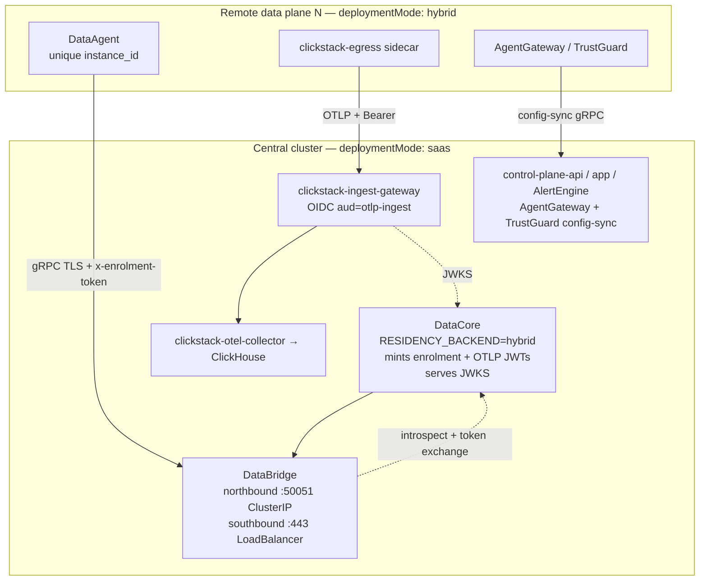

# `saas` mode — run your own control plane for data planes in other clusters

`global.deploymentMode: saas` renders a control plane that behaves like
NeuralTrust's hosted one, but is yours. Data planes in other clusters — typically
one per business unit, jurisdiction or environment — enrol into it instead of
into `neuraltrust.ai`.

Use it when a single `external` install cannot work because the data must stay
where it was produced, but the console, alerting and cross-cluster reporting
have to be in one place.

If every workload fits in one cluster, use [`external`](../README-EXTERNAL.md).
If NeuralTrust hosts the control plane, use `hybrid`.

## Topology



`saas` is a superset of `external`: everything `external` renders, plus three
additions and one behaviour change.

| Addition | Why |
|---|---|
| `databridge` | Remote DataAgents hold a bidirectional gRPC stream here; DataCore queries across them northbound. Stores nothing. |
| `clickstack-ingest-gateway` | Public OTLP edge. Verifies DataCore-issued RS256 JWTs and stamps the tenant from the verified claim, so an untrusted sender cannot write another tenant's telemetry. |
| Published config-sync Services | Products in the remote clusters pull their configuration from the central control planes. |

The behaviour change: DataCore runs `RESIDENCY_BACKEND=hybrid` rather than
`saas`, so entitled reads go out through DataBridge to the remote clusters
instead of straight to the local ClickHouse.

## Endpoints

Set `global.controlPlane.domain` on **both** the central cluster and every
remote cluster. It is a bare DNS suffix — no scheme, port or path — and the
chart derives every cross-cluster endpoint from it:

| Endpoint | Served by | Dialled by |
|---|---|---|
| `databridge.<domain>:443` | `databridge-southbound` Service | DataAgent |
| `https://telemetry.<domain>` | `clickstack-ingest-gateway` Ingress | clickstack-egress sidecar |
| `agentgateway-configsync.<domain>:443` | `agentgateway-admin-configsync` Service | AgentGateway data plane |
| `trustguard-configsync.<domain>:443` | `trustguard-control-plane-configsync` Service | TrustGuard data plane |

One knob drives all four on purpose. A remote cluster that reached DataBridge
on your domain but still dialled NeuralTrust for config-sync would half-work,
and the half that broke would be silent.

Leave `global.controlPlane.domain` empty to keep using NeuralTrust SaaS via
`global.saasRegion`.

## Prerequisites

Before installing, have these ready. Everything else the chart does for you.

| | What | Notes |
|---|---|---|
| 1 | Four DNS records, from the table above, resolving to the central cluster's load balancers | Create them after the first install, once the LBs have addresses. A private zone is fine. |
| 2 | A decision on certificates | See [TLS](#tls). Chart-generated needs nothing from you up front. |
| 3 | Network reachability from every remote cluster to all four endpoints | Peering, Transit Gateway, Direct Connect or the public internet — the chart does not care which. |
| 4 | An ingress controller in the central cluster | Only the telemetry endpoint uses one; the other three are layer-4 Services. |
| 5 | One enrolment token per remote data plane, from your console | See [Authentication](#authentication). |

### Images

Two images on top of the external set, both from the NeuralTrust registry, both
covered by the `gcr-secret` pull secret an external install already has:

```
europe-west1-docker.pkg.dev/neuraltrust-app-prod/nt-docker/databridge
europe-west1-docker.pkg.dev/neuraltrust-app-prod/nt-docker/opentelemetry-collector-contrib
```

The second is the same image and tag the hybrid egress sidecars run, so a mirror
that already carries it needs nothing new. `scripts/release-images-markdown.sh`
prints the full list with resolved tags for a mirroring run.

`global.imageRegistry` retargets both, including the collector — it strips the
NeuralTrust registry rather than prefixing it, so the result is
`<your-registry>/databridge`, not `<your-registry>/europe-west1-docker.pkg.dev/…`.
The two older collector copies (`global.observability.collector`,
`global.clickstack.egress`) are the exception and still need their `repository`
set by hand.

## TLS

All four endpoints are dialled from other clusters. Each one terminates TLS
itself, so each needs a certificate covering its hostname, and each remote
cluster needs to accept it. There are three ways to get there, and they can be
mixed per endpoint.

| Endpoint | Bring your own | cert-manager | Chart-generated |
|---|---|---|---|
| `databridge.<domain>:443` | `databridge.tls.existingSecret` | `databridge.tls.certManager.enabled: true` | `databridge.tls.autoGenerate: true` |
| `agentgateway-configsync.<domain>:443` | `agentgateway.configSync.grpcTls.existingSecret` | — | `agentgateway.configSync.expose.selfSignedTls: true` |
| `trustguard-configsync.<domain>:443` | `trustguard.configSync.grpcTls.existingSecret` | — | `trustguard.configSync.expose.selfSignedTls: true` |
| `https://telemetry.<domain>` | `clickstack-ingest-gateway.ingress.tls.secretName` | via `ingress.annotations` | `clickstack-ingest-gateway.ingress.tls.autoGenerate: true` |

The chart refuses to render an endpoint with no certificate at all, rather than
publishing one nothing can verify. Which option to pick depends on how the remote
clusters reach you.

### A certificate the data planes already trust

If your data planes traverse the public internet, or you already run an internal
PKI whose root is in their trust stores, supply the certificates:

```yaml
databridge:
  tls:
    existingSecret: databridge-southbound-tls   # or certManager.enabled: true
agentgateway:
  configSync:
    grpcTls:
      existingSecret: agentgateway-configsync-tls
trustguard:
  configSync:
    grpcTls:
      existingSecret: trustguard-configsync-tls
clickstack-ingest-gateway:
  ingress:
    tls:
      secretName: telemetry-tls
```

Nothing further is needed on the remote side: the default trust store already
accepts them.

On EKS an ACM certificate cannot serve the first three. TLS terminates in the
pod and ACM does not export private keys. It can serve the telemetry endpoint,
because that one terminates at the ALB. Use cert-manager or your own PKI for the
rest.

### Chart-generated, for a control plane on a private network

When remote clusters arrive over VPC peering, Direct Connect or a private link,
no public trust store is involved and there is nothing to buy. Let the chart mint
everything and distribute the CA as configuration:

```yaml
databridge:
  tls:
    autoGenerate: true
agentgateway:
  configSync:
    expose:
      selfSignedTls: true
trustguard:
  configSync:
    expose:
      selfSignedTls: true
clickstack-ingest-gateway:
  ingress:
    enabled: true
    tls:
      autoGenerate: true
```

Each component mints its own CA, so a remote cluster needs all four. Export them
as one bundle from the central cluster:

```bash
./scripts/export-controlplane-ca.sh -n neuraltrust -o controlplane-ca.yaml
```

Apply that Secret in each remote cluster and point the three dialling legs at it
— see [Remote clusters](#remote-clusters). Until you do, every remote handshake
fails: minting a certificate does not make anyone trust it.

Keypairs are preserved across upgrades — agents hold long-lived streams and a
reissue drops all of them — and are reissued only when the names they cover
change, which is what makes retargeting `global.controlPlane.domain` reach the
certificates. Rerun the export script after any such change.

### Keeping an endpoint off a load balancer entirely

To reach a config-sync listener over peering without publishing a Service, set
`<product>.configSync.expose.enabled: false` and route to the ClusterIP yourself.

For the endpoints that do get a LoadBalancer, prefer an internal scheme when the
callers are on a private network — see [AWS / EKS](#aws--eks).

## Manual steps

The chart handles certificates, secrets and endpoint derivation. Three things it
cannot do, because they live outside the cluster or outside this release:

1. **Create the DNS records.** The chart cannot know the LB addresses before the
   cloud assigns them.
2. **Copy the CA bundle to the remote clusters**, if you chose chart-generated
   certificates. One command per cluster, via
   `scripts/export-controlplane-ca.sh`; a Helm release cannot write into a
   cluster it is not installed in.
3. **Issue one enrolment token per remote data plane** from your console.

Everything else — keypairs, the shared platform secrets, the four endpoint
hostnames, DataCore's residency wiring — is rendered.

## Authentication

DataBridge must be able to tell the remote data planes apart. Two modes do that:

| `databridge.auth.mode` | How |
|---|---|
| `introspect` (default) | DataBridge asks the in-cluster DataCore about each enrolment token |
| `jwt` | DataBridge verifies DataCore-signed enrolment JWTs locally |

`token` and `dev` are rejected in `saas`. Both authenticate every data plane
with one shared credential and then trust the tenant each agent claims for
itself, so any enrolled data plane could read another's data.

Mint one enrolment token per remote data plane, each with its own
`instance_id`. Reusing one token collapses them into a single identity in every
query and audit trail.

## Secrets

Four credentials come from the shared `platform-secrets` and are generated for
you when the chart owns secrets:

| Key | Used by |
|---|---|
| `ENROLMENT_INTROSPECTION_TOKEN` | DataCore — compares what DataBridge presents |
| `DATACORE_SERVICE_TOKEN` | DataBridge — alias of the above, must hold the identical value |
| `ENROLMENT_SIGNING_SECRET` | DataCore — signs enrolment tokens |
| `TELEMETRY_JWT_PRIVATE_KEY_PEM` | DataCore — RS256 key for `aud=otlp-ingest` tokens the ingest gateway verifies |

If you pre-provision secrets yourself (`global.preserveExistingSecrets`,
`global.autoGenerateSecrets: false`, or `global.platformSecret.existingSecret`),
all four must be present, and the two token keys must hold one identical value —
otherwise every agent connection returns 401 with nothing visibly wrong on
either side. `./create-secrets.sh` with `DEPLOYMENT_MODE=saas` writes them
correctly, including the alias.

## AWS / EKS

Nothing in the chart is cloud-specific; the LoadBalancer Services take
free-form annotations. On EKS with the AWS Load Balancer Controller:

```yaml
databridge:
  service:
    southbound:
      type: LoadBalancer
      annotations:
        service.beta.kubernetes.io/aws-load-balancer-type: nlb
        # internal for peered/Direct Connect callers; internet-facing only when
        # the data planes genuinely traverse the internet.
        service.beta.kubernetes.io/aws-load-balancer-scheme: internal
      # NAT egress ranges of the remote clusters. Without this the endpoint is
      # reachable from anywhere the NLB is.
      loadBalancerSourceRanges: ["10.20.0.0/16"]

agentgateway:
  configSync:
    expose:
      annotations:
        service.beta.kubernetes.io/aws-load-balancer-type: nlb
        service.beta.kubernetes.io/aws-load-balancer-scheme: internal
      loadBalancerSourceRanges: ["10.20.0.0/16"]

clickstack-ingest-gateway:
  ingress:
    enabled: true
    annotations:
      kubernetes.io/ingress.class: alb
      alb.ingress.kubernetes.io/scheme: internal
```

Use the same shape for `trustguard.configSync.expose`. On GKE the private
equivalent is `networking.gke.io/load-balancer-type: "Internal"`; on AKS,
`service.beta.kubernetes.io/azure-load-balancer-internal: "true"`.

An internal scheme keeps the whole topology off the public internet, which is
also what makes chart-generated certificates a reasonable production choice
rather than a rehearsal shortcut.

Notes specific to this topology on AWS:

- **NLB, not ALB.** DataBridge and config-sync are long-lived gRPC streams with
  TLS terminated in the pod. An ALB would have to re-terminate, and gRPC support
  there needs per-controller annotations that differ across clouds.
- **The ingest gateway is HTTP**, so it goes through an Ingress and an ALB is
  fine. It is the only one of the three that is not layer 4.
- **DataBridge holds its agent registry in memory** at one replica with
  `strategy: Recreate`. Every remote data plane's query path drops on restart.
  Plan maintenance windows until that has an HA story.
- **Central data stores** (RDS PostgreSQL, ElastiCache, ClickHouse) follow the
  normal `external` guidance — see [Datastores](../README.md#datastores).

## Remote clusters

Each remote cluster is an ordinary `hybrid` install pointed at your domain:

```yaml
global:
  deploymentMode: hybrid
  controlPlane:
    domain: nt.example.com
  products:
    trustgate: true
    trustguard: true
```

Its enrolment and config-sync tokens are issued by **your** console, not by the
NeuralTrust one. Everything else in the
[hybrid quick start](../README.md#quick-start-hybrid) applies unchanged.

### One-knob retarget (domain + optional dial hosts + CA)

`global.controlPlane` is the single place to point a hybrid install at a
distinct control plane — the same model as the Docker bundle's
`CONTROL_PLANE_*` env vars:

| Values key | Expands to |
|---|---|
| `domain` | `databridge.<domain>:443`, `<product>-configsync.<domain>:443`, `https://telemetry.<domain>` |
| `databridgeAddr` | DataAgent `DATABRIDGE_ADDR` (SNI stays `databridge.<domain>`) |
| `configSyncAddr` | both products' `CONFIG_SYNC_GRPC_ENDPOINT` (SNI stays `<product>-configsync.<domain>`) |
| `telemetryUrl` | egress collector OTLP/HTTP base |
| `caSecretName` | mount + `TLS_CA_FILE` / `CONFIG_SYNC_TLS_CA` / egress `ca_file` |

```yaml
global:
  deploymentMode: hybrid
  controlPlane:
    domain: neuraltrust.es
    # Optional: dial raw NLBs when DNS for *.<domain> is not ready yet.
    # SNI still uses the domain-derived cert names above.
    databridgeAddr: k8s-neuraltr-databrid-….elb.eu-west-1.amazonaws.com:443
    configSyncAddr: k8s-neuraltr-agentgat-….elb.eu-west-1.amazonaws.com:443
    # telemetryUrl: https://k8s-….elb.amazonaws.com   # only if telemetry is also on an NLB
    caSecretName: controlplane-ca   # apply scripts/export-controlplane-ca.sh output first
  products:
    trustgate: true
```

Per-product overrides (`dataagent.databridge.addr`, `agentgateway.configSync.endpoint`,
`global.clickstack.egress.endpoint`, explicit `tlsCa` paths) still win when set.

### Trusting a chart-generated control plane

Only needed if the central cluster serves chart-generated certificates. Apply the
bundle from `scripts/export-controlplane-ca.sh`, then either use the one-knob
form above (`caSecretName`) or expand the three legs by hand:

```yaml
global:
  controlPlane:
    domain: nt.example.com
    caSecretName: controlplane-ca   # preferred — expands all three legs
# equivalent long form:
#   customCaCert:
#     enabled: true
#     secretName: controlplane-ca
#   clickstack:
#     egress:
#       tlsCaSecretName: controlplane-ca
# dataagent:
#   databridge:
#     tlsCa: /etc/ssl/certs/custom-ca.crt
# agentgateway / trustguard:
#   configSync:
#     tlsCa: /etc/ssl/certs/custom-ca.crt
```

`tlsCa` **replaces** the system roots for that connection rather than adding to
them. One bundle carrying every CA the leg needs is the way to hold both a
private control plane and a TLS-intercepting proxy.

Before rolling out, confirm from inside a remote cluster that it can reach all
four central endpoints — the failure mode for a blocked security group is a
data plane that starts cleanly and then quietly serves stale configuration.
